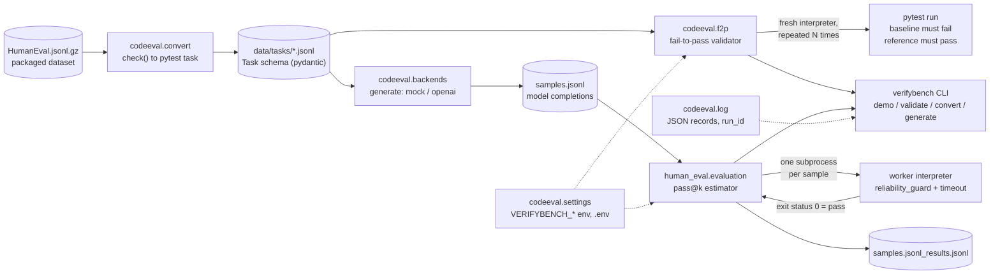

Forked from https://github.com/openai/human-eval.

# VerifyBench

[](https://github.com/vipul21435/verifybench/actions/workflows/ci.yml)

VerifyBench is an evaluation harness for LLM-generated code, built on OpenAI's
[human-eval](https://github.com/openai/human-eval): the HumanEval dataset and
the pass@k evaluator from the paper "[Evaluating Large Language Models Trained
on Code](https://arxiv.org/abs/2107.03374)". The fork keeps the upstream
`human_eval` package importable with its evaluation semantics and grows a
`codeeval` package around it: a pydantic task schema, a fail-to-pass validator
that proves every grader rejects a stub and accepts the reference, a converter
from HumanEval problems to pytest tasks, typed settings, JSON logging, a CLI
with an offline demo, and a digest-pinned Docker image.

Status: the pieces above are implemented, tested (517 tests, 99% line and
branch coverage) and run in CI on every push. The FastAPI service, the SQLite
results store, the Docker sandbox grader and the submission ledger are not
built yet; see "What I would do next". No network access and no model API key
are needed for anything in this repository.

## What I built on top

Every item below is fork work; `git log --author=vipul21435@iiitd.ac.in`
lists the commits.

- **Packaging**: `pyproject.toml` with a hatchling build and dependencies
  locked with uv on Python 3.12; the `pkg_resources`-based `setup.py` is gone
  and the HumanEval dataset ships inside the wheel (`human_eval/data/`), so
  `read_problems()` works after `pip install .`.
- **Subprocess worker**: each sample runs in a fresh interpreter started with
  `subprocess` instead of a `multiprocessing` worker plus a `Manager` process.
  No start method is forced and no `__main__` guard is needed, which fixes the
  upstream `EOFError` on macOS.
- **Timeouts that start when the program starts**: the worker reports
  `started` after booting and the per-sample clock starts then, so interpreter
  start-up under load no longer turns correct solutions into `timed out`.
- **A pass that the completion cannot forge**: the verdict is the worker's
  exit status, produced only after the check program ran through. Upstream
  trusted a `Manager` list the completion could append `"passed"` to.
  `reliability_guard` additionally disables `os._exit`, `exec*`,
  `posix_spawn*`, the `posix` aliases of the `os` denylist and `ctypes`.
- **Upstream CLI fixes**: `--k=1,2,4` no longer crashes (`fire` passes a
  tuple) and pass@k values are plain floats.
- **Types, lint, tests**: `mypy --strict`, ruff, and a pytest suite that
  reproduces the documented example numbers end to end.
- **Typed settings** (`codeeval.settings`): every knob is a `VERIFYBENCH_*`
  variable or `.env` entry validated by pydantic-settings; a bad value raises
  `ConfigError` naming the variable.
- **Structured logging** (`codeeval.log`): one JSON object per record with
  `run_id` and `task_id` bound through `bind_context()`, and a text fallback.
- **Task schema** (`codeeval.tasks`): a pydantic `Task` (prompt, entry point,
  reference solution, baseline stub, pytest `tests`, language, difficulty,
  metadata) validated statically, and JSONL suites whose errors name the file
  and line.
- **Fail-to-pass validator** (`codeeval.f2p`): runs each task's tests against
  the baseline and the reference in fresh interpreters, repeats them to catch
  flaky graders, and returns `ok`, `baseline_passes`, `reference_fails`,
  `flaky` or `error` with every run's exit status, duration and output.
- **HumanEval converter** (`codeeval.convert`): `check(candidate)` becomes a
  pytest module, the canonical solution the reference, a `NotImplementedError`
  stub the baseline; `data/tasks/humaneval_mini.jsonl` (20 tasks) is
  regenerated byte for byte.
- **CLI and demo** (`codeeval.cli`, `codeeval.demo`): `verifybench demo`,
  `validate`, `convert` and `generate`; the demo generates canonical and stub
  completions with the mock backend, validates the mini suite and scores the
  samples with pass@k in about 9 seconds, offline.
- **CI and Docker**: a GitHub Actions workflow running ruff, mypy, pytest with
  coverage, a digest-pinned non-root `python:3.12-slim` image that runs the
  demo, a compose file, and a CI job that builds the image and runs the demo
  in it.
- **Model backends and sample generation** (`codeeval.backends`): a
  `ModelBackend` protocol with a deterministic `MockBackend` (replays canned
  completions per task id, seeded stub failure rate) and an `OpenAIBackend`
  for any OpenAI-compatible chat endpoint (stdlib HTTP, timeouts, retries,
  off unless selected, key from `VERIFYBENCH_OPENAI_API_KEY`);
  `verifybench generate` writes the `samples.jsonl` the evaluator scores.
  Tests drive the HTTP client against a local fake server, never the network.

## Architecture



The upstream `human_eval` package (bottom row) scores completions; the
`codeeval` package (top row) makes sure the graders deserve to be trusted
before any completion is scored, and wraps both in configuration, logging and
a CLI.

## Quickstart

Requires [uv](https://docs.astral.sh/uv/getting-started/installation/)
(it installs Python 3.12 itself if needed) and, for the last line, Docker.

```
git clone https://github.com/vipul21435/verifybench && cd verifybench
uv sync
make demo
uv run verifybench validate data/tasks/humaneval_mini.jsonl
uv run verifybench generate --tasks data/tasks/humaneval_mini.jsonl --n 4 --failure-rate 0.25 --out results/mock/samples.jsonl
uv run evaluate_functional_correctness results/mock/samples.jsonl --problem_file=results/demo/problems.jsonl --k=1,2,4
docker build -t verifybench:dev . && docker run --rm verifybench:dev
```

`make demo` validates the 20 bundled tasks, scores 40 completions and prints
the table shown under "Sample output"; it exits 0 only if every task behaved
as expected. The Docker line builds the image and runs the same demo inside
it as a non-root user. `docker compose run --rm demo` does the same with
outputs kept in a named volume.

## CLI and API reference

### `verifybench` (also `python -m codeeval`)

| Command | What it does | Exit status |
| --- | --- | --- |
| `verifybench demo [--tasks FILE] [--limit N] [--repeats N] [--workers N] [--timeout S] [--results-dir DIR]` | generates two completions per task with the mock backend (the canonical solution, then a `NotImplementedError` stub), validates the task suite, then scores the samples with pass@1 and pass@2; writes `samples.jsonl`, `problems.jsonl`, the results file and `summary.json` under `<results-dir>/demo` | 0 when every task is `ok`, every canonical completion passed and every stub failed; 1 otherwise |
| `verifybench validate FILE [--repeats N] [--workers N] [--timeout S]` | fail-to-pass validation of a JSONL task file; prints `task_id<TAB>verdict` per task and the verdict counts | 0 when all `ok`, 1 otherwise |
| `verifybench convert OUTPUT [--limit N] [--problem-file FILE]` | ports HumanEval problems to a task file (`--limit 0` ports all 164) | 0 |
| `verifybench generate --tasks FILE --out samples.jsonl [--backend mock\|openai] [--n K] [--limit N] [--canned FILE] [--failure-rate F] [--seed S]` | asks a model backend for K completions per task and writes `{task_id, completion, backend, index}` lines for `evaluate_functional_correctness`; `mock` (default) replays `--canned` or, without it, each task's reference solution and swaps a `--failure-rate` fraction for a `NotImplementedError` stub; `openai` needs `VERIFYBENCH_OPENAI_API_KEY` | 0; 2 on a missing key, an unknown task id in the canned file or a provider failure |

Any `CodeEvalError` (unreadable file, invalid task, bad setting) is printed
as one line on stderr and becomes exit status 2. Every command logs JSON
records to stderr (`VERIFYBENCH_LOG_FORMAT=text` for plain lines).

### `evaluate_functional_correctness` (upstream CLI)

```
uv run evaluate_functional_correctness samples.jsonl [--k=1,10,100] [--n_workers=4] [--timeout=3] [--problem_file=...]
```

Reads `{"task_id": ..., "completion": ...}` lines, runs each completion in a
fresh interpreter, writes `<samples>_results.jsonl` (each sample plus
`passed` and `result`, one of `passed`, `timed out`, `failed: <reason>`) and
prints the pass@k dict. `--n_workers` and `--timeout` default to the
settings. With the bundled example:

```
$ uv run evaluate_functional_correctness data/example_samples.jsonl --problem_file=data/example_problem.jsonl --k=1,2,4
{'pass@1': 0.4999999999999999, 'pass@2': 0.8, 'pass@4': 1.0}
```

### Python API

| Import | Purpose |
| --- | --- |
| `codeeval.tasks.Task`, `TaskSuite`, `read_tasks(path)`, `write_tasks(path, tasks)` | the task schema and JSONL suites; `DataError("<file>:<line>: ...")` on bad input |
| `codeeval.f2p.validate_task(task, repeats=3, timeout=30.0)`, `validate_suite(suite, workers=None)` | fail-to-pass verdicts (`TaskVerdict`, `SuiteVerdict` with `.counts`, `.ok`, `.failures`) |
| `codeeval.convert.humaneval_to_task(problem)`, `humaneval_to_tasks(limit=20)` | HumanEval problems to tasks |
| `codeeval.demo.run_demo(tasks_file, limit=None, repeats=3)`, `render_report(report)` | the demo as a function returning a `DemoReport` |
| `codeeval.backends.ModelBackend`, `MockBackend.from_jsonl(path, seed=0, failure_rate=0.0)`, `OpenAIBackend(base_url, model, api_key, timeout=60, retries=2)`, `make_backend("mock"\|"openai", canned=..., pairs=...)`, `generate_samples(backend, [(task_id, prompt), ...], n=1)`, `write_samples(path, samples)`, `reference_completions(suite)` | model backends and sample generation; `ProviderError` when a backend cannot answer, `ConfigError` for a missing key or canned file |
| `codeeval.settings.get_settings()`, `override_settings(**changes)` | typed settings, cached per process; the override is how tests pin values |
| `codeeval.log.configure_logging()`, `bind_context(run_id=...)` | the JSON logger and its bound context |
| `codeeval.errors.CodeEvalError` and `ConfigError`, `DataError`, `ProviderError`, `ExecutionError`, `GradingError`, `StorageError` | the exception hierarchy, one class per pipeline stage |
| `human_eval.evaluation.evaluate_functional_correctness(sample_file, k, n_workers, timeout, problem_file)`, `estimate_pass_at_k(n, c, k)` | the upstream evaluator and estimator |
| `human_eval.execution.check_correctness(problem, completion, timeout)` | one completion, one fresh interpreter |
| `human_eval.data.read_problems()`, `stream_jsonl`, `write_jsonl` | the packaged dataset and JSONL helpers |

Not built yet (planned, see below): a FastAPI service, the SQLite results
store, the Docker sandbox grader, an Anthropic backend and the submission
ledger. The settings
already carry `sandbox_backend`, `docker_image` and `db_path` for them, but
`sandbox_backend=docker` selects nothing today: completions always run in a
local subprocess.

### Configuration

Every setting is a field of `codeeval.settings.Settings`, set with a
`VERIFYBENCH_<NAME>` environment variable or the same key in `.env`
(`.env.example` lists them all). An environment variable beats a `.env`
entry, which beats the default.

| Variable | Default | Meaning |
| --- | --- | --- |
| `VERIFYBENCH_SAMPLE_TIMEOUT` | `3.0` | seconds one sample may run before it is graded as timed out |
| `VERIFYBENCH_WORKERS` | `4` | samples and tasks processed concurrently |
| `VERIFYBENCH_RESULTS_DIR` | `results` | directory that receives run outputs (`results/demo` for the demo) |
| `VERIFYBENCH_LOG_FORMAT` | `json` | log record format: `json` or `text` |
| `VERIFYBENCH_LOG_LEVEL` | `INFO` | least severe log level emitted |
| `VERIFYBENCH_SEED` | `0` | seed for everything randomised (the mock backend's stub draw) |
| `VERIFYBENCH_MODEL_BACKEND` | `mock` | backend `verifybench generate` uses when `--backend` is not given: `mock` or `openai` |
| `VERIFYBENCH_MOCK_FAILURE_RATE` | `0.0` | fraction of mock completions replaced by a `NotImplementedError` stub (0 to 1) |
| `VERIFYBENCH_OPENAI_BASE_URL` | `https://api.openai.com/v1` | base URL of an OpenAI-compatible chat completions API (point it at a local server) |
| `VERIFYBENCH_OPENAI_MODEL` | `gpt-4o-mini` | model name sent to that API |
| `VERIFYBENCH_OPENAI_API_KEY` | unset | bearer token; the openai backend refuses to start without one and nothing is sent unless `--backend openai` is asked for |
| `VERIFYBENCH_OPENAI_TIMEOUT` | `60.0` | seconds one HTTP request may take |
| `VERIFYBENCH_OPENAI_RETRIES` | `2` | retries (backoff 0.5 s, 1 s, ...) after a transport error, HTTP 429 or 5xx |
| `VERIFYBENCH_SANDBOX_BACKEND` | `subprocess` | reserved for the Docker grader; only `subprocess` does anything today |
| `VERIFYBENCH_DOCKER_IMAGE` | `python:3.12-slim` | reserved for the Docker grader |
| `VERIFYBENCH_DB_PATH` | `results/verifybench.sqlite` | reserved for the SQLite store |

## Sample output

`make demo` on the bundled suite (stderr, which carries the JSON log records
and the evaluator's progress bars, omitted):

```
$ make demo
uv run python -m codeeval demo
Reading samples...
Running test suites...
Writing results to results/demo/samples.jsonl_results.jsonl...
VerifyBench demo: data/tasks/humaneval_mini.jsonl (20 tasks)

[1/3] generation: 40 completions from the mock backend (2 per task: canonical solution, then NotImplementedError stub)
      results/demo/samples.jsonl in 0.0s

[2/3] fail-to-pass validation: 20 tasks x 2 solutions x 3 repeats = 120 grader runs, 4 workers, 30s timeout each
      ok=20 baseline_passes=0 reference_fails=0 flaky=0 error=0 in 8.2s

[3/3] pass@k evaluation: 40 completions, 4 workers, 3s timeout each
      pass@1=0.500 pass@2=1.000 in 0.5s

task_id       entry_point                difficulty  f2p  samples  passed  pass@1  canonical  stub
------------  -------------------------  ----------  ---  -------  ------  ------  ---------  ------
HumanEval/0   has_close_elements         medium      ok         2       1    0.50  passed     failed
HumanEval/1   separate_paren_groups      hard        ok         2       1    0.50  passed     failed
HumanEval/2   truncate_number            easy        ok         2       1    0.50  passed     failed
HumanEval/3   below_zero                 medium      ok         2       1    0.50  passed     failed
HumanEval/4   mean_absolute_deviation    easy        ok         2       1    0.50  passed     failed
HumanEval/5   intersperse                medium      ok         2       1    0.50  passed     failed
HumanEval/6   parse_nested_parens        medium      ok         2       1    0.50  passed     failed
HumanEval/7   filter_by_substring        easy        ok         2       1    0.50  passed     failed
HumanEval/8   sum_product                medium      ok         2       1    0.50  passed     failed
HumanEval/9   rolling_max                medium      ok         2       1    0.50  passed     failed
HumanEval/10  make_palindrome            medium      ok         2       1    0.50  passed     failed
HumanEval/11  string_xor                 medium      ok         2       1    0.50  passed     failed
HumanEval/12  longest                    medium      ok         2       1    0.50  passed     failed
HumanEval/13  greatest_common_divisor    easy        ok         2       1    0.50  passed     failed
HumanEval/14  all_prefixes               easy        ok         2       1    0.50  passed     failed
HumanEval/15  string_sequence            easy        ok         2       1    0.50  passed     failed
HumanEval/16  count_distinct_characters  easy        ok         2       1    0.50  passed     failed
HumanEval/17  parse_music                easy        ok         2       1    0.50  passed     failed
HumanEval/18  how_many_times             medium      ok         2       1    0.50  passed     failed
HumanEval/19  sort_numbers               hard        ok         2       1    0.50  passed     failed

results: results/demo/samples.jsonl_results.jsonl
verdict: OK, every task behaved as expected
```

pass@1 is 0.5 by construction: each task gets one correct and one failing
completion, and the estimator is unbiased. A grader that accepted the stub
would show `baseline_passes` in the `f2p` column and `passed` under `stub`,
and the demo would exit 1.

The same generate step with a partly failing "model": the mock replays each
task's reference solution but swaps a seeded 25% of completions for the
stub, and the upstream evaluator scores the result against the problem
subset the demo wrote (JSON log records omitted):

```
$ uv run verifybench generate --tasks data/tasks/humaneval_mini.jsonl --n 4 --failure-rate 0.25 --out results/mock/samples.jsonl
80 samples from mock for 20 tasks -> results/mock/samples.jsonl
$ uv run evaluate_functional_correctness results/mock/samples.jsonl --problem_file=results/demo/problems.jsonl --k=1,2,4
Reading samples...
Running test suites...
Writing results to results/mock/samples.jsonl_results.jsonl...
{'pass@1': 0.65, 'pass@2': 0.8833333333333332, 'pass@4': 1.0}
```

With seed 0 the draw stubbed 28 of the 80 completions (35%, the expected
25% plus sampling noise), so pass@1 is 0.65 and every task still has at
least one passing sample, hence pass@4 = 1.0. `--backend openai` runs the
same pipeline against a live OpenAI-compatible endpoint once
`VERIFYBENCH_OPENAI_API_KEY` (and, for a local server,
`VERIFYBENCH_OPENAI_BASE_URL`) is set; nothing is sent otherwise.

One JSON log record from the same run:

```
{"timestamp": "2026-09-28T21:45:32.196Z", "level": "INFO", "logger": "codeeval.f2p", "message": "validated suite", "command": "demo", "counts": {"ok": 20, "baseline_passes": 0, "reference_fails": 0, "flaky": 0, "error": 0}, "duration": 6.836, "n_tasks": 20, "ok": true, "repeats": 3, "run_id": "961847a6aa85"}
```

## Design decisions and tradeoffs

- **Validate graders before scoring models.** A benchmark task is only as
  good as its tests. Every task carries a reference that must pass and a
  baseline that must fail, and the validator repeats both runs (3 by default)
  so a flaky grader is caught before a model's number depends on it. The cost
  is 6 pytest runs per task; on this machine that is about 60 ms per run of
  work spread over 4 workers, which is cheap next to a single model call.
- **A subprocess per sample, not a pool.** Upstream used `multiprocessing`
  with a `Manager` per sample. A plain subprocess per sample costs one
  interpreter start (about 40 ms) but needs no start method, no `__main__`
  guard, and gives the parent a verdict (the exit status) that the completion
  cannot reach. The timeout clock starts when the worker says it is running
  the program, so a loaded machine does not produce false `timed out` results.
- **Exit status is the only evidence of a pass.** The worker exits 0 only
  after the check program returned normally; a completion that prints
  `passed` or reaches into module globals gains nothing. `reliability_guard`
  is still not a sandbox, so a completion could in principle find the
  harness's own references; the README says so and the Docker grader is the
  planned fix.
- **Tasks are complete modules, not prompt plus completion.** Reference and
  baseline are whole files the tests import as `solution`, so a task can be
  graded by any pytest-capable runner (including a container) with no
  knowledge of how the completion was produced. The tradeoff is that the
  HumanEval demo has to look up the original problem to score completions the
  upstream way; the converter records `upstream_task_id` in metadata for that.
- **pydantic with `strict=True`, `frozen=True`, `extra="forbid"`.** A task
  file with a typo in a field name fails to load instead of silently carrying
  an unused key. Static checks (parses, defines the entry point, imports
  `solution`, has a test function) run at load time; dynamic ones are the
  validator's job.
- **Settings through one typed object.** Every knob has one name, one
  default, one validation rule and one error message; tests pin values with
  `override_settings` instead of touching the environment.
- **JSON logs on stderr, results on stdout and disk.** Machines read the
  records; humans read the table. Bound context (`run_id`, `task_id`) means
  records from libraries carry the same ids.
- **Keep `human_eval` importable.** The upstream API and numbers are
  unchanged, so anything written against `human_eval` keeps working; the
  fork's additions live in `codeeval`.
- **What was left out on purpose.** No model provider, no network calls, no
  database: the repository is fully offline and every number in it can be
  reproduced with `make demo`.

## Benchmarks

Measured on 2026-09-29 on an Apple Silicon Mac (Apple M2, 8 cores, 8 GB RAM),
macOS, Python 3.12.13, uv-managed virtualenv, nothing else running. All
numbers are wall-clock from a single run; the harness itself does not
resample.

| What | Command | Result |
| --- | --- | --- |
| Offline demo, 20 tasks | `time make demo` | 8.9 s wall-clock (real 8.92, user 22.66, sys 5.36) |
| Sample generation inside the demo | part of `make demo` | 40 completions from the mock backend in under 0.05 s (reported as 0.0 s) |
| Fail-to-pass validation inside the demo | part of `make demo` | 120 grader runs (20 tasks x 2 solutions x 3 repeats) in 8.2 s with 4 workers, i.e. about 15 pytest runs/s |
| pass@k evaluation inside the demo | part of `make demo` | 40 completions in 0.5 s with 4 workers, i.e. about 80 samples/s (each in a fresh interpreter) |
| Mock generation, 20 tasks x 4 samples | `time uv run verifybench generate --tasks data/tasks/humaneval_mini.jsonl --n 4 --failure-rate 0.25 --out results/mock/samples.jsonl` | 80 samples in 0.50 s wall-clock, interpreter start-up included |
| Upstream evaluator on those 80 samples | `time uv run evaluate_functional_correctness results/mock/samples.jsonl --problem_file=results/demo/problems.jsonl --k=1,2,4` | 1.58 s wall-clock; pass@1 0.65, pass@2 0.883, pass@4 1.0 |
| Test suite with coverage | `uv run pytest -q --cov=codeeval --cov=human_eval` | 517 tests in 64.8 s; 99% line and branch coverage (1393 statements, 8 missed); `codeeval.backends` and `codeeval.demo` at 100% |
| Docker image build from a clean cache | `time docker build --no-cache -t verifybench:dev .` | 22.4 s wall-clock (pip install of the locked dependencies included; Docker Desktop VM with 8 CPUs and 4 GB) |
| Demo inside the container | `time docker run --rm verifybench:dev` | 28.8 s wall-clock, same 120 grader runs and 40 completions, inside the 4 GB Docker Desktop VM |

The task suite is small on purpose: 20 tasks make the demo quick and the
output readable. `verifybench convert all.jsonl --limit 0` ports all 164
HumanEval problems and `verifybench validate all.jsonl` validates them; the
cost scales linearly with the number of grader runs.

## What I would do next

In order of value:

1. **More backends and concurrent generation.** An Anthropic Messages
   backend beside the OpenAI-compatible one, prompt templates per task
   suite, and `generate --workers N` so long suites are sampled in parallel
   with per-task retries recorded on the sample.
- **Docker sandbox grader.** Honour `VERIFYBENCH_SANDBOX_BACKEND=docker`:
  run each task's pytest in a digest-pinned container with no network, a
  read-only root, a pids limit and a memory limit (the compose file already
  applies these to the demo). That closes the remaining gap in
  `reliability_guard`.
- **pass@k bootstrap confidence intervals and reports.** Resample tasks to
  give every pass@k a 95% interval, write a Markdown/JSON report per run, and
  make the demo's numbers comparable across models rather than a sanity check.
- **SQLite results store and an LLM judge with a rubric.** Persist every run
  (`VERIFYBENCH_DB_PATH` is reserved for it), then add a rubric-driven judge
  for tasks whose correctness is not a pytest verdict, with judge outputs
  stored beside the execution results and audited against the graders.
- **Submission ledger with dedupe and contamination checks.** Hash every
  completion, flag exact and near duplicates across submissions, and check
  completions against the reference solutions and known public solutions
  before a number is reported.
- **Typer CLI and FastAPI service.** Promote the argparse CLI to Typer with
  the same commands, and expose `validate`, `run` and `results` over HTTP so
  a queue of submissions can be graded by a long-running service.

## Development

```
make check        # ruff check, ruff format --check, mypy --strict, pytest
make ci           # the CI workflow's exact commands, coverage.xml included
make test-fast    # skip the tests that spawn subprocesses
make coverage     # pytest with branch coverage
make format       # auto-fix lint findings and reformat
make demo         # the offline demo
```

Layout:

- `human_eval/` - the upstream package: dataset loading (with
  `HumanEval.jsonl.gz` in `human_eval/data/`), per-sample execution, the
  pass@k estimator and the `evaluate_functional_correctness` CLI.
- `codeeval/` - the harness package: `errors`, `settings`, `log`, `tasks`,
  `f2p`, `convert`, `demo`, `cli`.
- `data/` - the example problem and samples, and
  `data/tasks/humaneval_mini.jsonl`, the ported task suite.
- `tests/` - pytest suite; tests marked `slow` spawn worker processes.
- `Dockerfile`, `docker-compose.yml`, `.github/workflows/ci.yml` - the image,
  the compose service and the CI workflow (lint, typecheck, test with
  coverage, docker build plus demo).

**This program runs untrusted model-generated code.** Each sample executes in
a fresh interpreter with a `reliability_guard` that disables the most
destructive functions, but that is not a security sandbox. Run evaluations
inside the container (or a VM you are prepared to lose).

Copy `.env.example` to `.env` to change settings locally; nothing in the
repository needs credentials.

## Known Issues

While evaluation uses very little memory, you might see the following error
message when the system is running out of RAM. Since this may cause some
correct programs to fail, we recommend that you free some memory and try again.
```
malloc: can't allocate region
```

## Citation

Please cite the upstream paper when using the HumanEval dataset or evaluator:

```
@article{chen2021codex,
  title={Evaluating Large Language Models Trained on Code},
  author={Mark Chen and Jerry Tworek and Heewoo Jun and Qiming Yuan and Henrique Ponde de Oliveira Pinto and Jared Kaplan and Harri Edwards and Yuri Burda and Nicholas Joseph and Greg Brockman and Alex Ray and Raul Puri and Gretchen Krueger and Michael Petrov and Heidy Khlaaf and Girish Sastry and Pamela Mishkin and Brooke Chan and Scott Gray and Nick Ryder and Mikhail Pavlov and Alethea Power and Lukasz Kaiser and Mohammad Bavarian and Clemens Winter and Philippe Tillet and Felipe Petroski Such and Dave Cummings and Matthias Plappert and Fotios Chantzis and Elizabeth Barnes and Ariel Herbert-Voss and William Hebgen Guss and Alex Nichol and Alex Paino and Nikolas Tezak and Jie Tang and Igor Babuschkin and Suchir Balaji and Shantanu Jain and William Saunders and Christopher Hesse and Andrew N. Carr and Jan Leike and Josh Achiam and Vedant Misra and Evan Morikawa and Alec Radford and Matthew Knight and Miles Brundage and Mira Murati and Katie Mayer and Peter Welinder and Bob McGrew and Dario Amodei and Sam McCandlish and Ilya Sutskever and Wojciech Zaremba},
  year={2021},
  eprint={2107.03374},
  archivePrefix={arXiv},
  primaryClass={cs.LG}
}
```

## License

MIT. The original code and dataset are Copyright (c) OpenAI; see
[LICENSE](LICENSE). Changes in this fork are released under the same license.
